# SubTracked-T3A2-A

## Description:

 

***What is SubTracked?***

- Purpose

    - The SubTracked application is a subscription management platform, allowing users to roll all of their subscriptions together into one easy web application. This allows users to manage their subscriptions with ease, removing the stress of not knowing when payments are due.

 

- Functionality and Features

   - SubTracked features:
     - an intuitive design inspired by a 'less is more' approach, making it is easy to navigate and manage subscriptions
     - alerts to notify users when they have upcoming payments, including cost and due date
     - a flexible creation system allowing for any subscription to be managed by users, including the facility to edit and delete subscriptions as needed

 

- Target Audience

   - SubTracked is designed for anyone who wants to keep up to date with their subscriptions and take control of their subscription costs

 

- Tech Stack

    - SubTracked features a diverse tech stack, including:

       - Ruby on Rails

       - JavaScript

       - React

       - HTML5

       - CSS3

       - PostgreSQL Database

       - Deployed on: Heroku (Backend) & Netlify (Frontend)

 

## Dataflow Diagram:

 

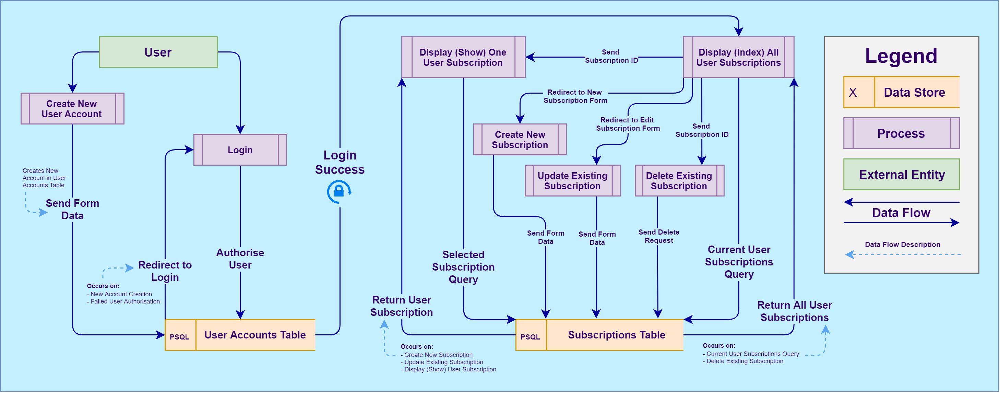

 

## Application Architecture Diagram:

 

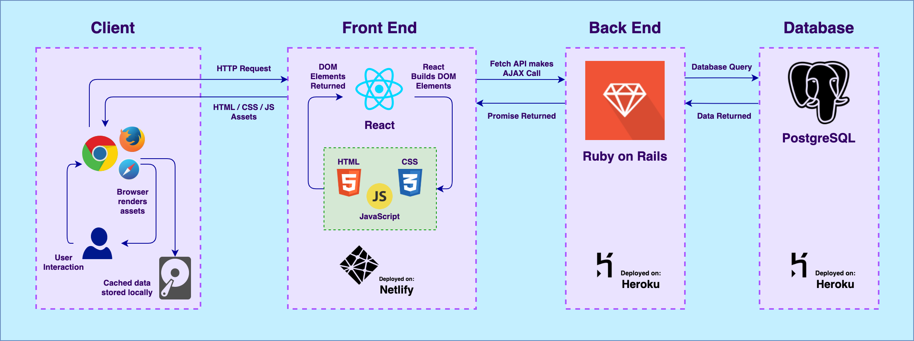

 

## ERD:

 

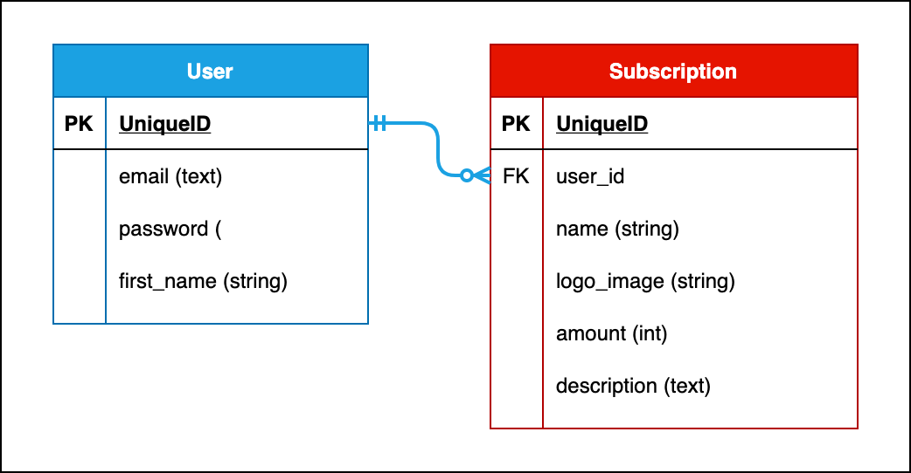

 

 

## User Stories:

 

***As a user, I want to:***

- be able to keep track of my paid subscriptions in order to budget and keep on top of my finances
    - This speaks to the overall functionality of the application and has not ultimately changed since the idea was selected for the project.

- be able to create and edit my own subscriptions, including the billing frequency and amount
    - Initially, this requirement was just for the creation and editing of a subscription with the amount, but it seemed more useful to allow users to choose the billing frequency for each subscription as each will have a different billing cycle. Including this frequency allows users to see in their dashboard a countdown to the due date for every subscription, providing the application significantly more utility.

- be able to delete subscriptions after I've unsubscribed from them
    - This was an early requirement that has not changed since inception.

- be alerted when a subscription is due and how much it will cost
    - Notifications were initially omitted due to project time frame constraints, but were ultimately included as they will make up a large part of the success of the application, as a subscription management platform that doesn't notify users of upcoming payments is unlikely to be very useful.

- be able to navigate the application easily via a simple and intuitive interface
    - An easy-to-use interface was a key requirement from the initial planning phase for the application.

 

## Wireframes:

 

<a href="./docs/img/diagrams/subtracked-wireframes.pdf">SubTracked Wireframes (PDF)</a>

 

## Trello:

 

    

    Trello Screenshots (Click to expand):
    

    - Day 1:
    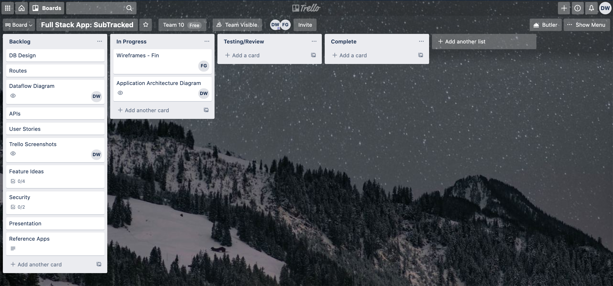
    - Day 2:
    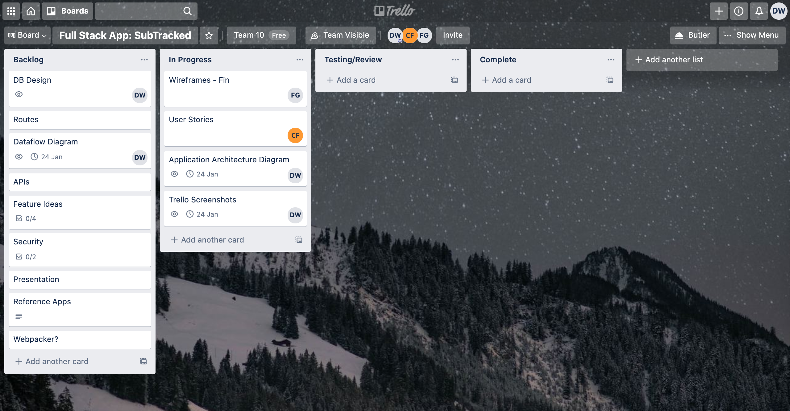
    - Day 3:
    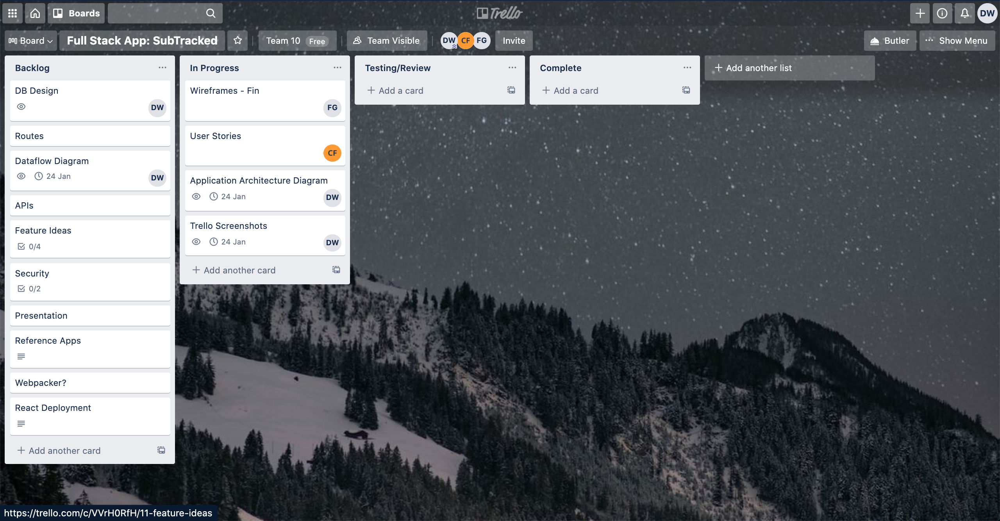
    - Day 5:
    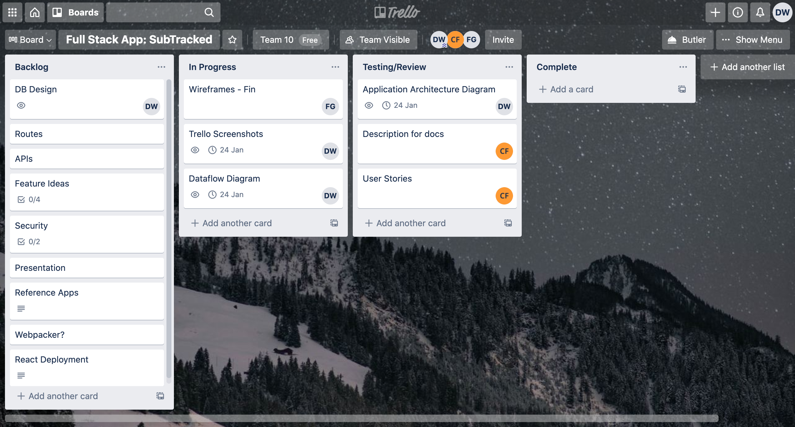
    - Day 6:
    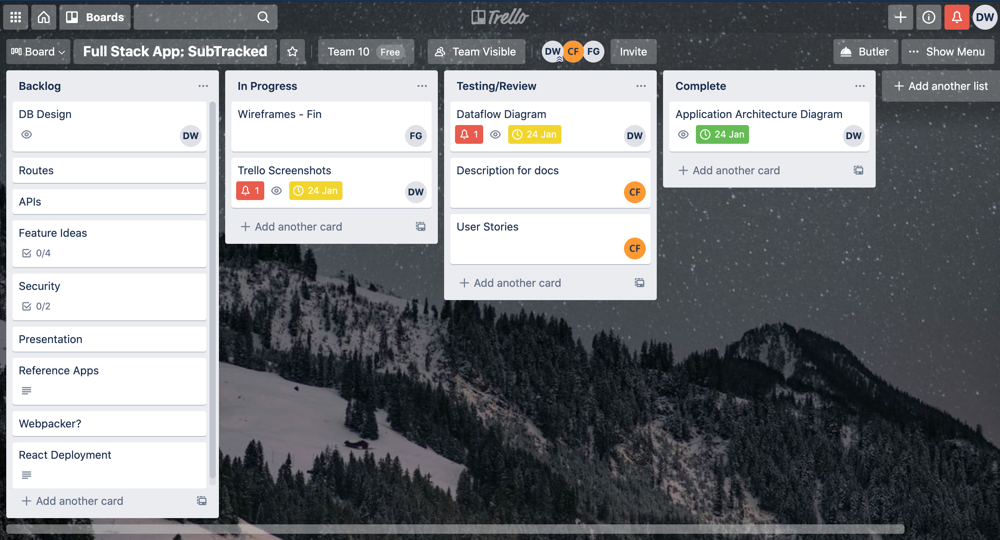
    - Day 7:
    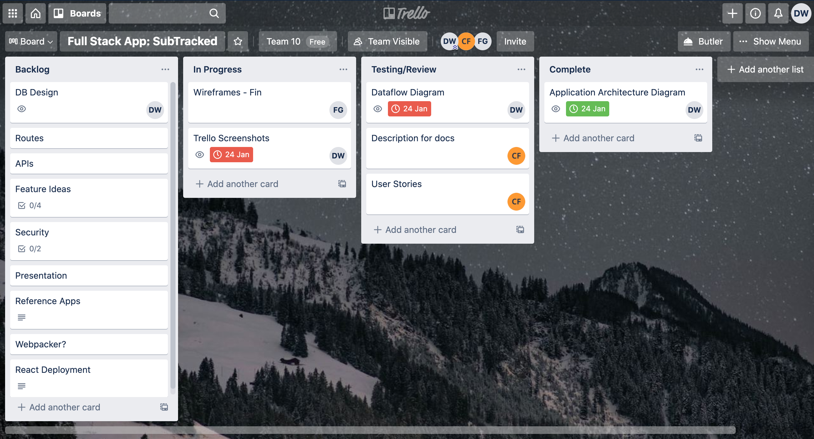
    - Day 8:
    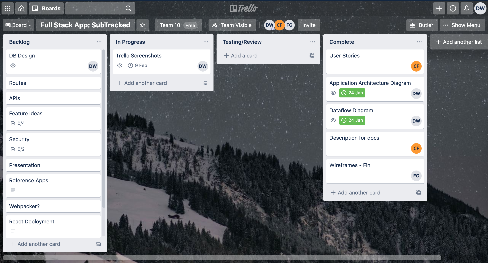
    - Day 10:
    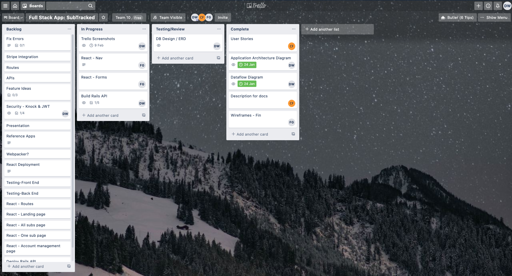
    - Day 11:
    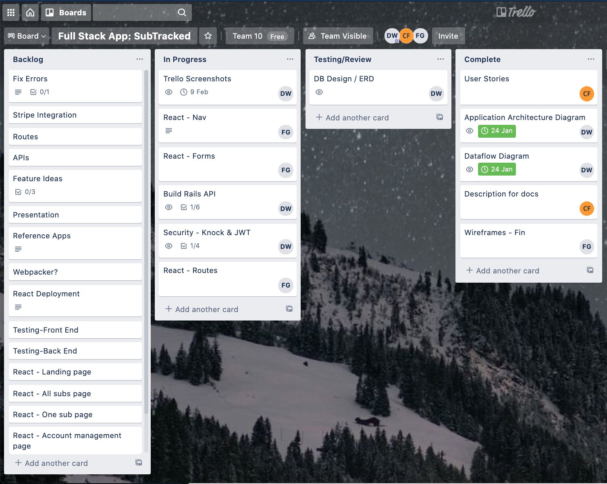
    - Day 12:
    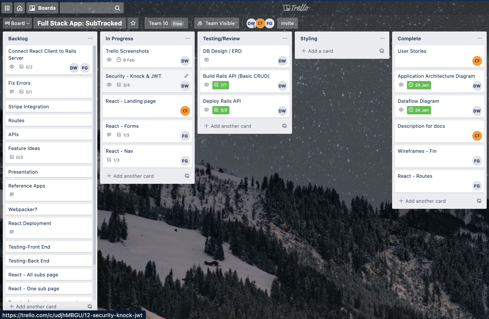
    - Day 14:
    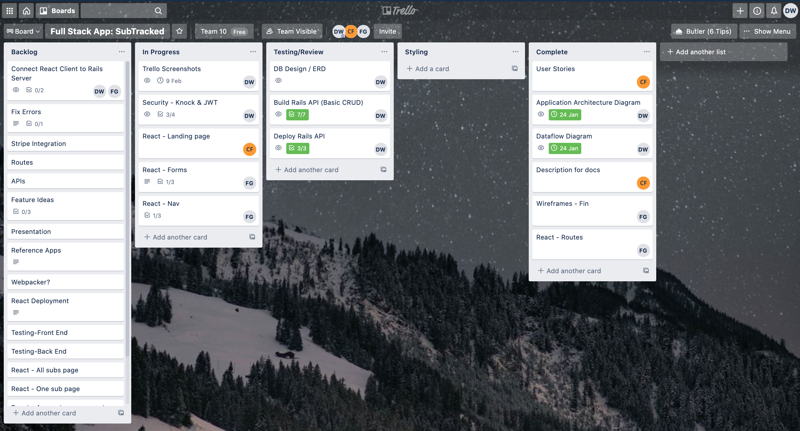
    - Day 16:
    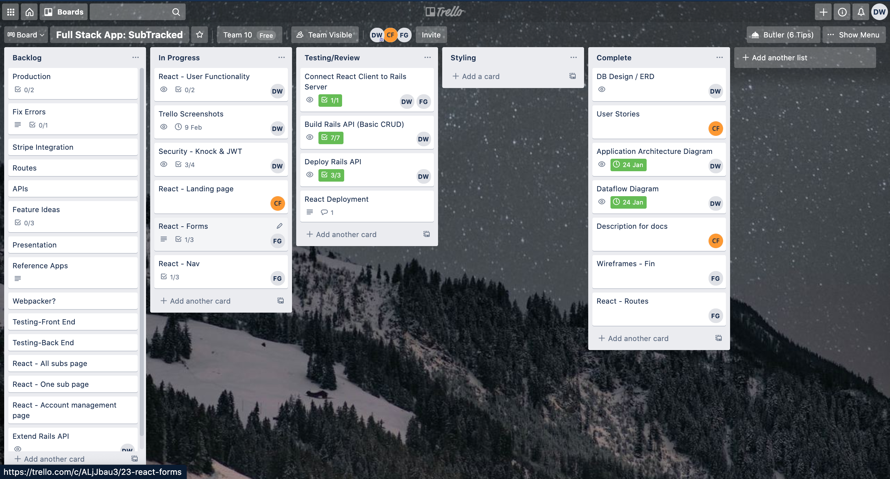

 