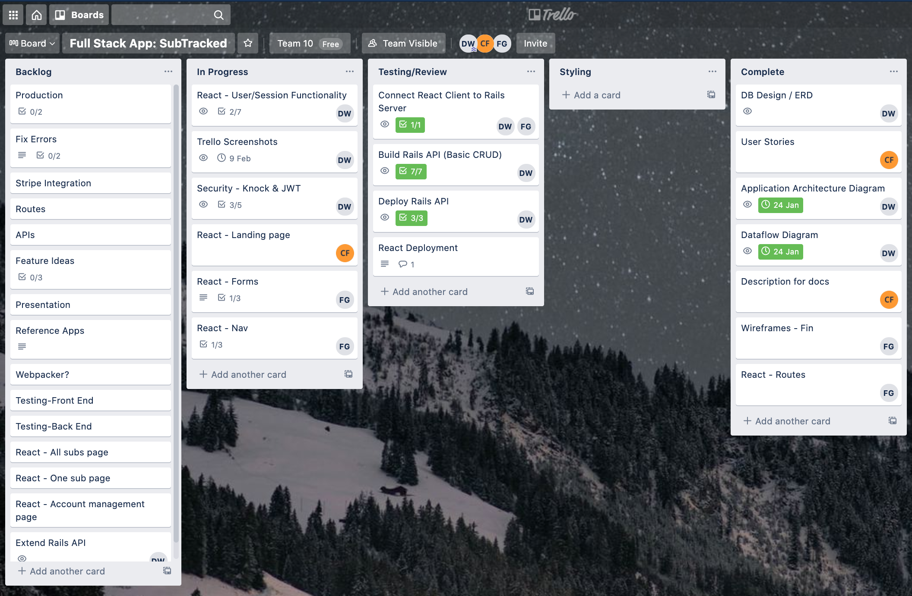

# SubTracked-T3A2-A

## Deployed Site:

 

Front-End: 

Back-End: https://subtracked-server.herokuapp.com/
- Requires authentication token so can only be accessed via front-end application

 

## Github:

 

Back-End:
- https://github.com/waldowred5/subtracked-server

Front-End:
- https://github.com/Finbob12/subtracked-react

 

## Description:

 

***What is SubTracked?***

- Purpose

    - The SubTracked application is a subscription management platform, allowing users to roll all of their subscriptions together into one easy web application. This allows users to manage their subscriptions with ease, removing the stress of not knowing when payments are due.

 

- Functionality and Features

   - SubTracked features:
     - an intuitive design inspired by a 'less is more' approach, making it is easy to navigate and manage subscriptions
     - alerts to notify users when they have upcoming payments, including cost and due date
     - a flexible creation system allowing for any subscription to be managed by users, including the facility to edit and delete subscriptions as needed

 

- Target Audience

   - SubTracked is designed for anyone who wants to keep up to date with their subscriptions and take control of their subscription costs

 

- Tech Stack

    - SubTracked features a diverse tech stack, including:

       - Ruby on Rails

       - JavaScript

       - React

       - HTML5

       - CSS3

       - PostgreSQL Database

       - Deployed on: Heroku (Backend) & Netlify (Frontend)

 

## Dataflow Diagram:

 

 

## Application Architecture Diagram:

 

 

## ERD:

 

 

 

## Libraries:

 

Back-End:
- Knock
    - Knock is an authentication solution for API-only rails applications. Knock is stateless and authenticates users with JSON web tokens.
- Bcrypt
    - Bcrypt is a ruby gem that creates secure passwords. It is based on the hashing algorithm created by Niels Provos and David Mazières of the OpenBSD Project.
- Rack-CORS
    - Rack-CORS is a middleware that provides Cross-Origin Resource Sharing Support, allowing web applications to make AJAX calls across domains.

Front-End:
- React-Bootstrap
    - React-Bootstrap is a CSS component library built for React, to replace the outdated bootstrap library for JavaScript. It provides a large number of pre-configured styles for components to create responsive and modern looking websites with ease.
- React Router
    - React Router is a collection of routing components that make building website navigation in React declarative.

 

## Testing:

 

End-User Testing:
- Screen captures can be found in the following folder: './spec/end_user_testing'

Back-End Testing:
- Testing suites can be found for user and subscription models in the following folder: './spec/models' and can be run with the command: `bin/rspec`

 

## Project Management Methodology:

 

During the development of 'SubTracked', the project was managed with the Kanban style. 
- After initial user requirements were identified, the application was split into two sections, back-end and front-end
- These applications were created separately and tasks were created in Trello, being designated to one of 4 states:
    - Backlog: For all tasks that were ideated during the brainstorming stage of development
    - In Progress: For all tasks currently being worked on
    - Testing: For completed tasks that were ready to be reviewed by another member of the team
    - Complete: For tasks that have been built and marked by the team as a working, successfully completed feature or application milestone

 

## User Stories:

 

***As a user, I want to:***

- be able to keep track of my paid subscriptions in order to budget and keep on top of my finances
    - This speaks to the overall functionality of the application and has not ultimately changed since the idea was selected for the project.

- be able to create and edit my own subscriptions, including the billing frequency and amount
    - Initially, this requirement was just for the creation and editing of a subscription with the amount, but it seemed more useful to allow users to choose the billing frequency for each subscription as each will have a different billing cycle. Including this frequency allows users to see in their dashboard a countdown to the due date for every subscription, providing the application significantly more utility.

- be able to delete subscriptions after I've unsubscribed from them
    - This was an early requirement that has not changed since inception.

- be alerted when a subscription is due and how much it will cost
    - Notifications were initially omitted due to project time frame constraints, but were ultimately included as they will make up a large part of the success of the application, as a subscription management platform that doesn't notify users of upcoming payments is unlikely to be very useful.

- be able to navigate the application easily via a simple and intuitive interface
    - An easy-to-use interface was a key requirement from the initial planning phase for the application.

 

## Wireframes:

 

<a href="./docs/img/diagrams/subtracked-wireframes.pdf">SubTracked Wireframes (PDF)</a>

 

## Trello:

 

    

    Trello Screenshots (Click to expand):
    

    - Day 1:
    
    - Day 2:
    
    - Day 3:
    
    - Day 5:
    
    - Day 6:
    
    - Day 7:
    
    - Day 8:
    
    - Day 10:
    
    - Day 11:
    
    - Day 12:
    
    - Day 14:
    
    - Day 16:
    
    - Day 17:
    
    - Day 18:
    
    - Day 20:
    
    - Day 21:
    
    - Day 22:
    
    - Day 23:
    

 